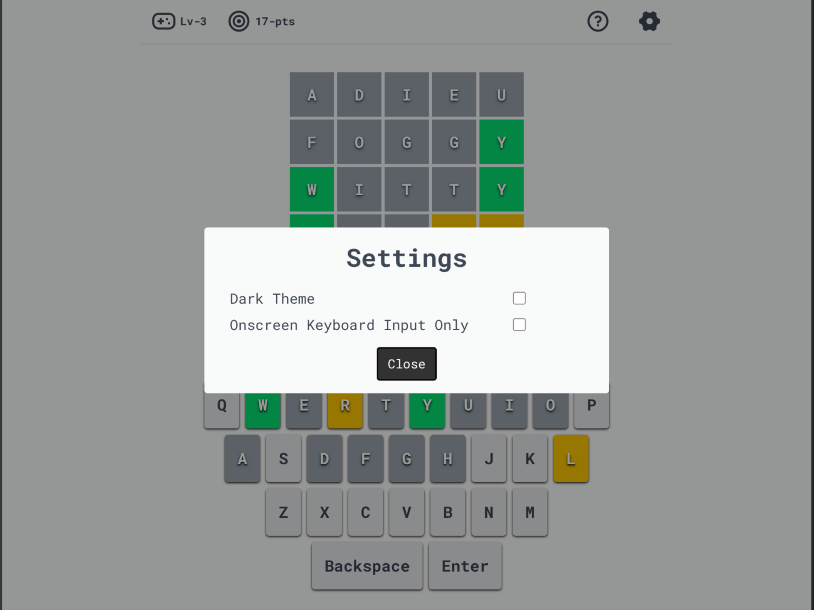

<h1>Wordle Infinite v2</h1>

A wordle clone with no time restrictions and progressively enhanced for offline functionality

<h2>Built using :</h2>

<ul>
    <li>SvelteKit</li>
    <li>TailwindCSS</li>
    <li>TypeScript</li>
    <li>
        <a href="https://remixicon.com/">Remix icon</a>
    </li>
    <li>
        <a href="https://localforage.github.io/localForage/">Localforage</a>
    </li>
    <li>
        <a href="https://svelte-french-toast.com/">Svelte french toast</a>
    </li>
</ul>

<h2>Screenshots :</h2>

